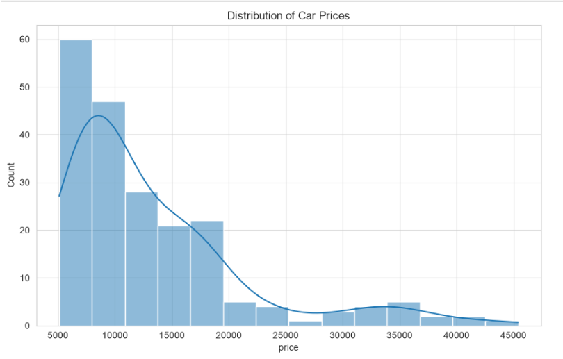
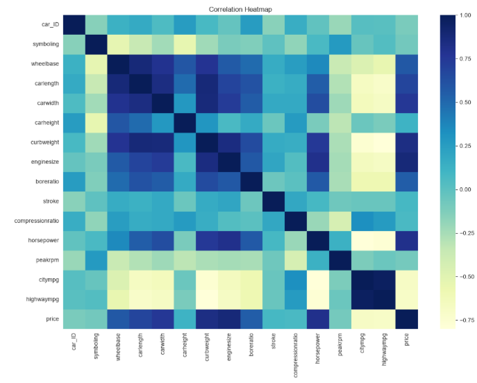
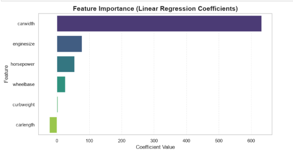
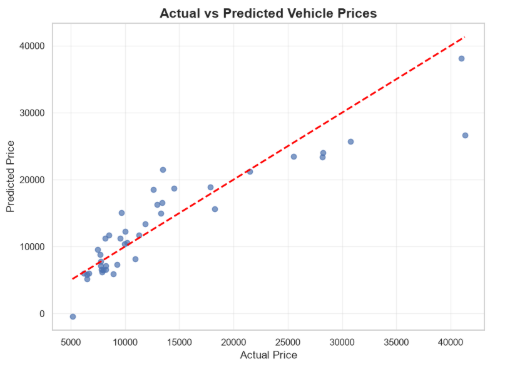

# 🚗 Car Price Prediction using Machine Learning


---

# 📌 Project Overview

This project develops a **Machine Learning Regression Model** to predict automobile prices using various vehicle specifications such as engine size, horsepower, dimensions, fuel type, and brand information.

The project follows a complete **Data Science workflow**, including data preprocessing, exploratory data analysis (EDA), feature engineering, model development, evaluation, and visualization.

---

# 🎯 Problem Statement

Car prices are influenced by multiple technical and brand-related factors. Accurately estimating a vehicle's selling price is valuable for:

- Automobile dealerships
- Used car marketplaces
- Insurance companies
- Buyers & Sellers
- Automotive analysts

The objective of this project is to build a regression model capable of predicting car prices based on historical vehicle data.

---

# 📂 Dataset Information

The dataset contains information about different automobile models including:

- Company / Brand
- Engine Size
- Horsepower
- Wheelbase
- Car Length
- Car Width
- Curb Weight
- Fuel Type
- Body Style
- Selling Price (Target Variable)

---

# 🛠 Technologies Used

- Python
- Pandas
- NumPy
- Matplotlib
- Seaborn
- Scikit-learn
- Jupyter Notebook

---

# 🔄 Project Workflow

```
Dataset
    │
    ▼
Data Cleaning
    │
    ▼
Feature Engineering
    │
    ▼
Exploratory Data Analysis
    │
    ▼
Feature Selection
    │
    ▼
Train-Test Split
    │
    ▼
Linear Regression Model
    │
    ▼
Model Evaluation
    │
    ▼
Business Insights
```

---

# 📊 Exploratory Data Analysis

The following visualizations were created to better understand the dataset:

- Price Distribution
- Correlation Heatmap
- Vehicle Body Type vs Price
- Fuel Type vs Price
- Horsepower vs Price
- Engine Size Analysis
- Brand-wise Average Price
- Actual vs Predicted Prices
- Feature Importance

---

# 🤖 Machine Learning Model

**Algorithm Used**

- Linear Regression

**Selected Features**

- Engine Size
- Horsepower
- Curb Weight
- Car Width
- Car Length
- Wheelbase

Target Variable:

- Price

---

# 📈 Model Performance

| Metric | Value |
|---------|-------|
| R² Score | **0.822** |
| MAE | **2678.0** |
| RMSE | **3743.8** |

The model demonstrates good predictive capability and successfully captures the relationship between important vehicle specifications and selling price.

---

# 💡 Key Insights

- Engine Size shows a strong positive relationship with vehicle price.
- Horsepower significantly influences automobile pricing.
- Premium brands have considerably higher average selling prices.
- Vehicle dimensions such as width and curb weight contribute positively to price prediction.
- Correlation analysis helped identify the most influential features used for model training.

---

# 📷 Project Visualizations

## Price Distribution



---

## Correlation Heatmap



---

## Feature Importance



---

## Actual vs Predicted Prices



---

# 📁 Project Structure

```
CAR_PRICE_PREDICTION
│
├── Car_Price_Prediction.ipynb
├── CarPrice_Assignment.csv
├── README.md
├── requirements.txt
├── Price Distrbution.png
├── Correlation Heatmap.png
├── Feature Importance.png
└── Actual Vs Predicted.png
```

---

# 🚀 How to Run

Clone the repository

```bash
git clone https://github.com/YOUR_USERNAME/CAR_PRICE_PREDICTION.git
```

Install required libraries

```bash
pip install -r requirements.txt
```

Open the notebook

```bash
Car_Price_Prediction.ipynb
```

Run all cells sequentially.

---

# 📌 Future Improvements

- Random Forest Regressor
- XGBoost Regressor
- Hyperparameter Tuning
- Cross Validation
- Model Deployment using Streamlit
- Interactive Prediction Dashboard

---

# 🎓 Learning Outcomes

Through this project, I gained practical experience in:

- Data Cleaning
- Feature Engineering
- Exploratory Data Analysis
- Regression Modeling
- Machine Learning Evaluation
- Business Insight Generation
- Data Visualization
- GitHub Project Documentation

---

# 👩‍💻 Author

**Diya Arjnani**

Engineering Student | Aspiring Data Analyst | Machine Learning Enthusiast

If you found this project useful, consider ⭐ starring the repository.
